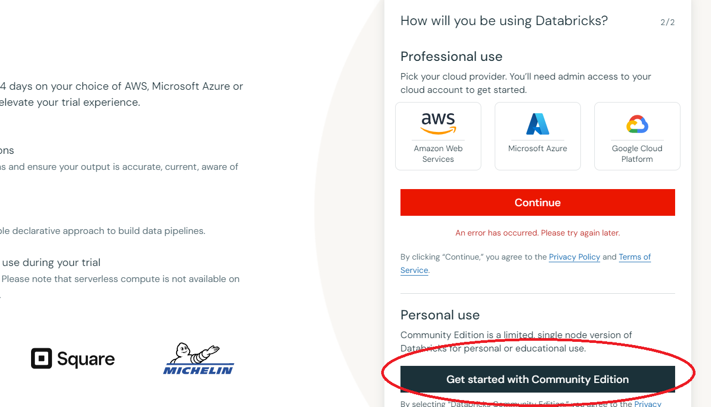

# Prework

## Sign up for Databricks Community Edition

Databricks is the company behind Apache Spark. The community edition offers you a cost-free environment (15GB RAM and 2 Cores) with the latest Apache Spark & much more. 

- To sign up for Databricks Community Edition, follow the instructions here: [https://docs.databricks.com/en/getting-started/community-edition.html](https://docs.databricks.com/en/getting-started/community-edition.html)
    - We recommend you use **UMN email** for the sign up. 
    - On the page, "How do you plan on using Databricks?", choose the **Community Edition**.
    - At the final page, be sure to choose the **"Get started with Community Edition"** (the grey button instead of the red button) -- see a picture below. 
    - As suggested, after signing in, you may try the [Get started: Query and visualize data from a notebook](https://docs.databricks.com/en/getting-started/quick-start.html) to familiarize yourself with Databricks.

- After that, you can bookmark this page [community.cloud.databricks.com](https://community.cloud.databricks.com/login.html?_ga=2.256757835.1990113872.1737411447-2021537352.1737411446) for future log on.

## Linux Shell Commands

We will spend some of our course time on Linux shell commands, which are often used in big data, cloud computing, and MLOps. It would be helpful for you to warm up to the concepts and commands with the following video and short web course. 

Here are some materials that warm you up to the concepts:

- [Learning the Shell (web tutorial)](https://linuxcommand.org/lc3_learning_the_shell.php): just focus on `Learning the Shell` chapter
- [Introduction to Linux Operating System (A gentle overview)](https://www.youtube.com/watch?v=V1y-mbWM3B8): only need to watch the segment of 18:05-52:03 (or the following topics)
    - [18:05 Introduction to Linux operating system and comparison with windows](https://www.youtube.com/watch?v=V1y-mbWM3B8&t=1085s)
    - [24:32 Terminal vs. File Manager](https://www.youtube.com/watch?v=V1y-mbWM3B8&t=1472s)
    - [27:20 Command Line Interfaces on Ubuntu Operating system](https://www.youtube.com/watch?v=V1y-mbWM3B8&t=1640s)
    - [49:19 Brief of Linux commands](https://www.youtube.com/watch?v=V1y-mbWM3B8&t=2959s)

## Some Useful Concepts in Computing

Big data is about completing tasks in parallel, using multiple computers. Naturally, it needs some background on how computing is done on a single computer.  These are a series of short videos explaining various concepts and aspects of computing.

- [https://www.youtube.com/watch?v=p3q5zWCw8J4](https://www.youtube.com/watch?v=p3q5zWCw8J4) (how do computer memory work)
- [https://www.youtube.com/watch?v=H_M--weEzpA](https://www.youtube.com/watch?v=H_M--weEzpA) (Memory versus Storage)
- [https://www.youtube.com/watch?v=IIvbEn54ZAY](https://www.youtube.com/watch?v=IIvbEn54ZAY) (CPUs and Cores)
- [https://www.youtube.com/watch?v=H4l42nbYmrU](https://www.youtube.com/watch?v=H4l42nbYmrU) (video explaining ASCII files)
- [https://www.youtube.com/watch?v=v7IpCq5YL68](https://www.youtube.com/watch?v=v7IpCq5YL68) (comparing plain text and binary files)
- [https://www.youtube.com/watch?v=BKgRaHMUul0](https://www.youtube.com/watch?v=BKgRaHMUul0) (explaining binary files and demonstrating difference in file types)

<!-- 
## Like to learn more? Try Docker

If you still have time and want to challenge yourself with some more hard-core concepts, you may learn this Introduction to Docker crash course. We will introduce the concept of containers in cloud computing and I may introduce some examples of using docker containers later in the course (but I have not fully decided).

- [https://www.youtube.com/watch?v=pg19Z8LL06w](https://www.youtube.com/watch?v=pg19Z8LL06w) (about 1 hour)

If you prefer reading about more it, here is a great introductory course:

- [https://docker-curriculum.com/](https://docker-curriculum.com/)

 -->
